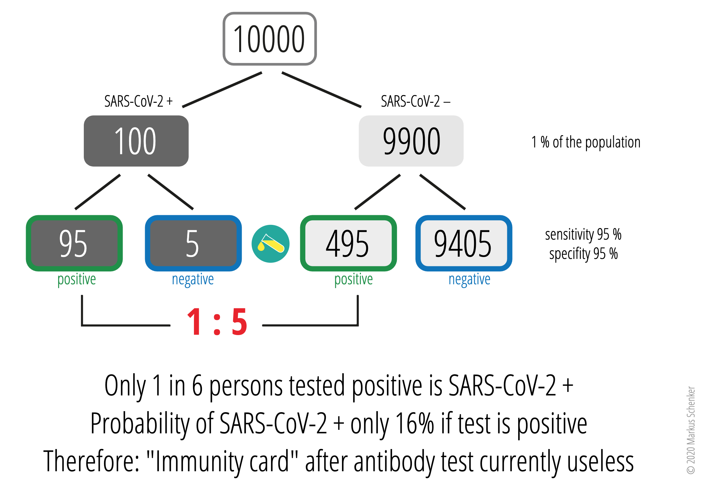
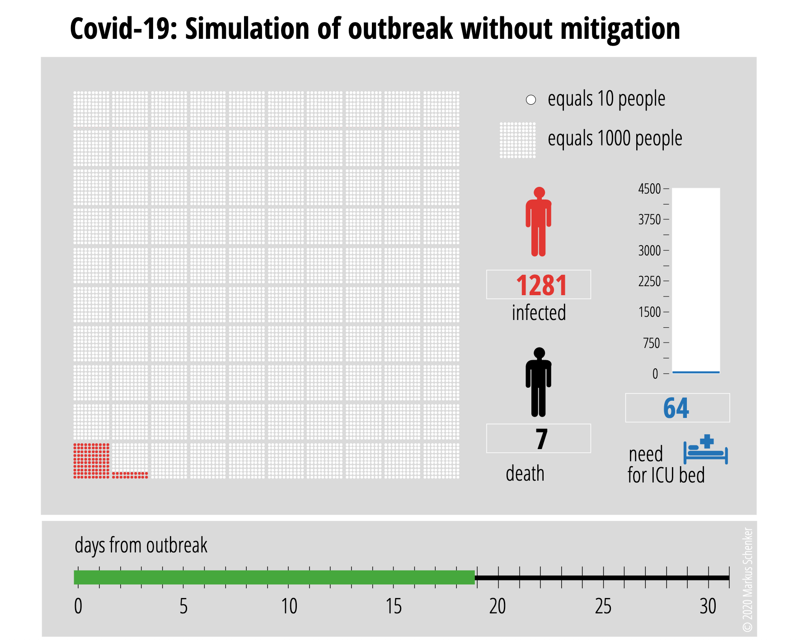
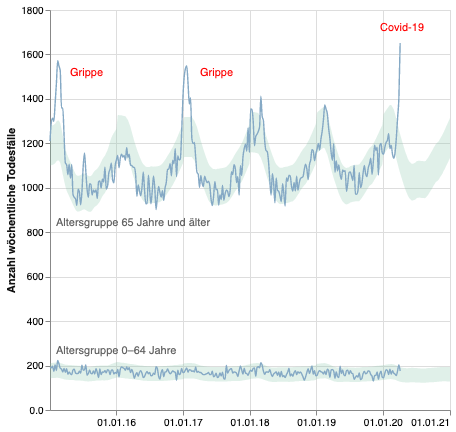

<html lang="en">
<head>
  <meta charset="utf-8">
  
  <title>Covid-19</title>
  <meta name="description" content="Resources">
  <meta name="author" content="Markus Schenker, Phi Network">
 
</head>

<body>
  
We publish on this site additional resources to Covid-19 pandemia, as i.e. graphs, animated graphs and links to other sites, mainly on epi-topics. A service by <a href="https://www.ebpswiss.ch">ebpswiss.ch</a>.

  <h2>Graphs and Animations</h2>
	

    	

	
<a href="images/aks_de.png" target="_blank">static de (png)</a> <a href="images/aks_en.png" target="_blank">static en (png)</a> <a href="images/aksanim_de.svg" target="_blank">animated de (svg)</a> <a href="images/aksanim_en.svg" target="_blank">animated en (svg)</a>

    	
Bayesian thinking in antibody tests for sars-cov-2: Animated and static versions in English and German

	

    	

	
<a href="images/covid19outbreak_de.svg" target="_blank">animated de (svg)</a> <a href="images/covid19outbreak_en.svg" target="_blank">animated en (svg)</a>

    	
Animation (number of cases, deaths and ICU need of Covid-19 outbreak without mitigation 

	

    	

  	
Visualization of deaths in Switzerland and overflow over expected values with probable causes. Will be acutalized end of each week.

	

  <h2>Links</h2>
  
<a href="https://ispmbern.github.io/covid-19/swiss-epidemic-model/" target="_blank">Real-time modeling and projections of the COVID-19 epidemic in Switzerland (ISPM Unibe)</a>

    
<a href="https://www.corona-data.ch/" target="_blank">Corona-data.ch information about Covid-19 epidemic in Switzerland</a>

	
<a href="https://www.update-covid.ch/en/" target="_blank">Collection of most relevant studies and guidelines in connection with Covid-19 (University Hospital Bern)</a>

	
<a href="https://interaktiv.derbund.ch/2020/covid-19-ausbruch-im-vergleich/" target="_blank">Gute laufend aktualisierte Datenübersicht von Der Bund/Tagesanzeiger</a>

