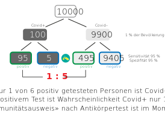

<html lang="en">
<head>
  <meta charset="utf-8">

  <title>Covid-19</title>
  <meta name="description" content="Resources">
  <meta name="author" content="Markus Schenker, Phi Network">
 <link rel="stylesheet" href="css/main.css">
</head>

<body>
  <h1>Covid-19 – additional resources</h1>
  
You can find on this page some additional resources to Covid-19 pandemia, as i.e. graphs, animated graphs and links to other sites, mainly on epi-topics.
  

